# PactDa Normal Flow Sequence Diagram (Modular MVP)

## Overview
This sequence diagram shows the complete normal flow of using PactDa's modular MVP, focusing on the core agreement logic with ProgrammaticResolver for wager-based games and trusted authority resolution.

## Mermaid Sequence Diagram

```mermaid
sequenceDiagram
    participant Dev as Developer
    participant Client as PactDa Client Portal
    participant Server as PactDa Server
    participant SDK as PactDa SDK
    participant Sui as Sui Blockchain
    participant Authority as Trusted Authority
    participant User1 as Party A (Player)
    participant User2 as Party B (Player)
    participant App as Developer's Game App

    %% Phase 1: Developer Onboarding
    Note over Dev, Client: Phase 1: Developer Onboarding & Setup
    Dev->>Client: Visit PactDa Portal
    Client->>Dev: Show landing page with gaming demo
    Dev->>Client: Click "Sign Up"
    Client->>Server: POST /auth/register
    Server->>Dev: Send email verification
    Dev->>Server: Verify email
    Server->>Client: Redirect to dashboard
    Client->>Dev: Show onboarding wizard
    Dev->>Client: Complete profile & select "Gaming" use case
    Client->>Server: Generate API keys
    Server->>Client: Return API keys (dev/staging/prod)
    Client->>Dev: Display API keys & gaming quick start guide

    %% Phase 2: SDK Integration
    Note over Dev, SDK: Phase 2: SDK Integration in Game App
    Dev->>App: Install @pactda/sdk-lite
    Dev->>SDK: pactda.init(apiKey, config)
    SDK->>Server: Validate API key
    Server->>SDK: Return validation + config
    SDK->>Dev: SDK initialized successfully
    Dev->>App: Set up trusted authority (game server/dev)

    %% Phase 3: Player Onboarding
    Note over User1, App: Phase 3: Player Onboarding
    User1->>App: Open game application
    App->>SDK: pactda.connectUser()
    SDK->>User1: Show auth options (Google/Email/Phone)
    User1->>SDK: Choose Google OAuth
    SDK->>Server: POST /auth/social-login
    Server->>User1: Redirect to Google OAuth
    User1->>Server: Complete Google authentication
    Server->>SDK: Return user session + wallet
    SDK->>App: User connected successfully
    App->>User1: Show game lobby

    User2->>App: Join game application
    App->>SDK: pactda.connectUser()
    SDK->>Server: Authenticate User2 (similar flow)
    Server->>SDK: Return User2 session + wallet
    SDK->>App: User2 connected successfully

    %% Phase 4: Game Agreement Creation
    Note over User1, Sui: Phase 4: Wager Agreement Creation
    User1->>App: Challenge User2 to Rock-Paper-Scissors (100 SUI wager)
    App->>SDK: pactda.createAgreement({
    Note over SDK: parties: [user1_address, user2_address],
    Note over SDK: wager: 100 SUI,
    Note over SDK: authority: authority_address,
    Note over SDK: gameType: "RockPaperScissors"
    Note over SDK: })
    
    SDK->>Server: POST /v1/agreements/create
    Server->>Server: Validate parties and authority
    Server->>Sui: Call create_agreement()
    Note over Sui: Create ProgrammaticResolver with authority_address
    Sui->>Sui: Create PactDaContract with resolver_id
    Sui->>Sui: Create linked Escrow object
    Sui->>Server: Emit AgreementCreated event
    Server->>SDK: Return agreement_id and escrow details
    SDK->>App: Agreement created successfully
    App->>User1: Show wager challenge sent

    %% Phase 5: Player 2 Acceptance & Funding
    Note over User2, Sui: Phase 5: Challenge Acceptance & Escrow Funding
    Server->>User2: Send challenge notification
    User2->>App: View challenge details
    App->>SDK: pactda.getAgreementStatus(agreement_id)
    SDK->>Server: GET /v1/agreements/{id}/status
    Server->>SDK: Return agreement details
    App->>User2: Show challenge: "100 SUI Rock-Paper-Scissors vs User1"
    User2->>App: Accept challenge

    %% Both players fund escrow
    User1->>App: Fund wager (100 SUI)
    App->>SDK: Fund agreement
    SDK->>Server: POST /v1/transactions/submit
    Server->>Sui: Call fund_escrow(contract, escrow, 100_SUI_coin)
    Sui->>Sui: Transfer 100 SUI from User1 to escrow
    Sui->>Server: Emit EscrowFunded event
    Server->>SDK: Real-time event via WebSocket
    SDK->>App: Trigger 'escrowFunded' event
    App->>User1: Show "Wager deposited: 100 SUI"

    User2->>App: Fund wager (100 SUI)
    App->>SDK: Fund agreement
    SDK->>Server: POST /v1/transactions/submit
    Server->>Sui: Call fund_escrow(contract, escrow, 100_SUI_coin)
    Sui->>Sui: Transfer 100 SUI from User2 to escrow
    Sui->>Server: Emit EscrowFunded event
    Server->>SDK: Real-time event via WebSocket
    SDK->>App: Trigger 'escrowFunded' event
    App->>User2: Show "Wager deposited: 100 SUI"
    App->>User1: Notify "User2 joined - Game starting!"
    App->>User2: Notify "Wager matched - Game starting!"

    %% Phase 6: Game Execution
    Note over User1, Authority: Phase 6: Game Play & Resolution
    App->>User1: Show "Choose: Rock, Paper, or Scissors"
    App->>User2: Show "Choose: Rock, Paper, or Scissors"
    User1->>App: Choose "Rock"
    User2->>App: Choose "Paper"
    
    App->>App: Both players submitted - determine winner
    App->>Authority: User2 wins (Paper beats Rock)
    
    %% Phase 7: Trusted Authority Reports Outcome
    Note over Authority, Sui: Phase 7: Outcome Reporting by Authority
    Authority->>App: Confirm game result
    App->>SDK: pactda.reportOutcome({
    Note over SDK: winner: user2_address,
    Note over SDK: reason: "Paper beats Rock"
    Note over SDK: })
    
    SDK->>Server: POST /v1/agreements/{id}/resolve
    Server->>Server: Validate authority permission
    Server->>Sui: Call report_outcome(resolver, user2_address)
    Note over Sui: assert!(sender == resolver.authority_address)
    Sui->>Sui: Set resolver.outcome = Some(user2_address)
    Sui->>Server: Emit OutcomeReported event
    Server->>SDK: Real-time event notification
    SDK->>App: Trigger 'outcomeReported' event
    App->>User1: Show "Game result: You lost - Paper beats Rock"
    App->>User2: Show "Game result: You won - Paper beats Rock!"

    %% Phase 8: Automatic Settlement
    Note over Server, Sui: Phase 8: Escrow Settlement
    Server->>Sui: Call settle_agreement(contract, escrow, resolver)
    Sui->>Sui: Read outcome from resolver (user2_address)
    Sui->>Sui: Transfer 200 SUI from escrow to User2
    Sui->>Server: Emit AgreementSettled event
    Server->>SDK: Real-time settlement notification
    SDK->>App: Trigger 'agreementCompleted' event
    App->>User1: Show "Payment sent to winner"
    App->>User2: Show "You received 200 SUI!"

    %% Phase 9: Post-Game Analytics
    Note over Dev, Server: Phase 9: Game Analytics & Impact Tracking
    Server->>Server: Update game statistics
    Server->>Client: Update developer dashboard
    Client->>Dev: Show game completion metrics
    App->>User1: Request game feedback
    App->>User2: Request game feedback
    User1->>App: Rate game experience
    User2->>App: Rate game experience
    App->>Server: POST /v1/analytics/impact/report
    Server->>Server: Update social impact metrics

    %% Success Confirmation
    Note over Dev, Server: ✅ Wager Game Successfully Completed
    Note over Dev, Server: Trust mechanism validated, fair gameplay ensured
```

## Key MVP Architecture Highlights

### 🎯 **Modular Design**
1. **Core Module (`pactda_core`)**: Generic agreement and escrow logic
2. **Resolution Module (`programmatic_resolver`)**: Simple trusted authority pattern
3. **Admin Module (`pactda_admin`)**: Administrative capabilities with AdminCap
4. **Clean Separation**: Core module agnostic to resolver implementation details

### 🔧 **Technical Simplifications**
1. **Single Resolver Type**: Only ProgrammaticResolver for MVP
2. **Direct Authority Check**: `assert!(sender == authority_address)` security
3. **Linked Objects**: PactDaContract ↔ Escrow ↔ ProgrammaticResolver
4. **Event-Driven**: All state changes emit events for off-chain tracking

### 🎮 **Gaming Use Case Focus**
1. **Wager-Based Games**: Perfect for Rock-Paper-Scissors, card games, etc.
2. **Trusted Game Server**: Developer/server acts as authority
3. **Instant Settlement**: No complex dispute resolution needed
4. **Fair Play**: Blockchain ensures escrow security and outcome immutability

### 🛡️ **Security & Trust**
1. **Escrow Protection**: Funds locked until game completion
2. **Authority Validation**: Only designated authority can report outcomes
3. **Immutable Results**: Blockchain ensures game results cannot be changed
4. **Audit Trail**: Complete history via events (AgreementCreated, EscrowFunded, OutcomeReported, AgreementSettled)

### 📊 **MVP Scope Boundaries**
- ✅ **Included**: Core agreements, programmatic resolution, gaming wagers
- ❌ **Excluded**: VCNFT voting, Wormhole integration, milestone payments, payment streaming
- 🎯 **Focus**: Pioneer Developer Event - simple, secure, functional

## Usage Instructions

1. Copy the Mermaid code above
2. Go to [mermaid.live](https://mermaid.live)
3. Paste the code in the editor
4. The diagram will render automatically
5. You can export as PNG, SVG, or share the link

This sequence diagram represents the streamlined MVP flow focused on the core modular architecture with ProgrammaticResolver, perfect for demonstrating trust-based gaming applications at the Pioneer Developer Event. 